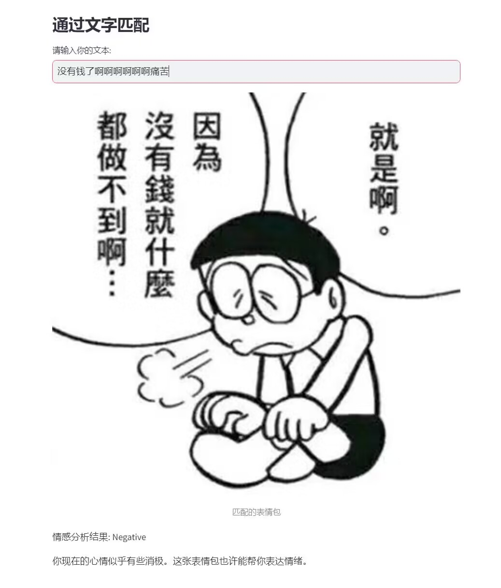
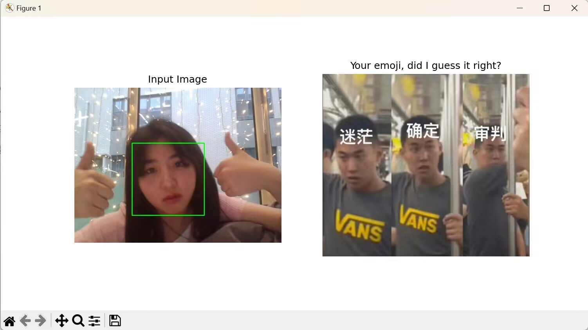
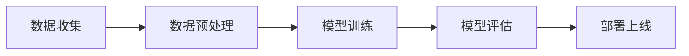
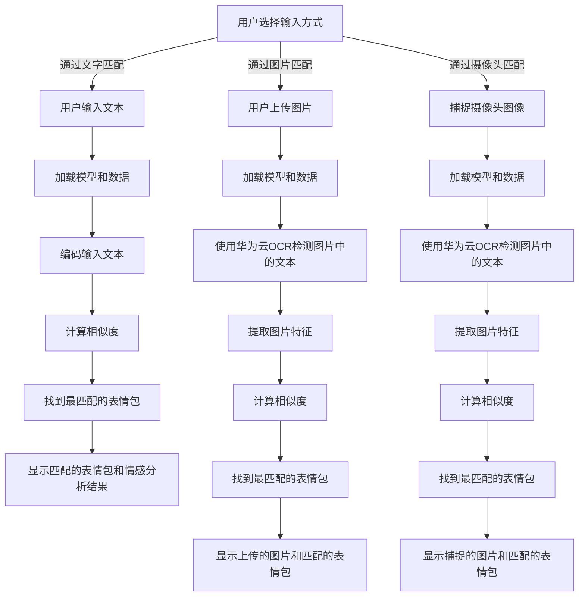

# 你的表情，我猜对了吗？

本项目旨在创建一个有趣的表情包匹配游戏。通过结合自然语言处理和计算机视觉技术，我们收集了大量网络上的表情包图片。用户可以通过以下三种方式进行交互：

1. **文字匹配**：用户可以输入任意文字，例如当前正在做的事情、当前的心情或者任何想要测试的内容。系统将输出最符合输入文本描述的表情包图片。

2. **图片上传**：用户可以上传任意图片，例如展示当前的活动或者自己的表情。系统将分析该图片并输出与之最匹配的表情包图片。

3. **即时人脸识别**：用户可以使用摄像头拍摄当前的表情。系统将实时捕捉图像中的面部特征，并匹配出最适合当前表情的表情包图片。

通过这些玩法，用户可以享受到一个有趣且个性化的表情包匹配体验。

---

# 游戏效果

第一种


第二种


第三种


# 项目实现

此项目大致可分为如下五步：



项目文件说明：

- `data_utils.py`：用于加载和预处理图片数据集，包括加载JSON格式的数据、定义图片的预处理方法、以及一个自定义数据集类。

- `model.py`：定义了一个基于ResNet-18的多模态神经网络模型，用于提取图像的特征。

- `train.py`：进行模型训练，加载图像数据集并使用预训练的ResNet-18模型在GPU上进行特征提取训练，最后保存模型权重。

- `extract_features.py`：提取图像特征和文本描述嵌入，并将这些特征保存为NumPy数组。

- `emoji_matching.py`：实现了一个应用程序，通过输入文本或图像检测文本并结合图像特征，来寻找和显示最匹配的表情符号。

- `visual.py`：一个使用Streamlit构建的应用程序，通过用户输入文本、上传图片或使用摄像头捕捉图像来匹配并显示最符合心情的表情包。

# 数据集

本项目使用的数据来源于[emo-visual-data](https://github.com/LLM-Red-Team/emo-visual-data)数据集，这是一个表情包视觉标注数据集，它收集了5329个表情包并使用 glm-4v api 和 step-free-api 项目通过多模态大模型完成的视觉标注。

数据集存储的格式如下：
```
emo-visual-data
│     
└───emo
│   │   000317dc-9047-4d68-bb55-e40c09ed0f9a.jpg
│   │   0005fce3-aefd-4694-bb94-55fbe56d0793.jpg
│   │   ...
│  
└───data.json
```

`data.json`格式如下：
```
{
    "filename": "000317dc-9047-4d68-bb55-e40c09ed0f9a.jpg",
    "content": "这个表情包展示了两只水豚，它们的表情看起来很是严肃，甚至有些不悦。图片的笑点在于它们的表情和图片上的文字“孤立他”，这种不匹配产生了幽默效果。通常，这样的表情包被用来幽默地表达对某人或某事的不满或反对，通过这种方式，可以轻松地在社交媒体上表达情绪，同时也能引发他人的共鸣和笑声。"
},
{
    "filename": "0005fce3-aefd-4694-bb94-55fbe56d0793.jpg",
    "content": "这个表情包中的内容是一本打开的书，上面的文字是：“每日一练：已知本地有a，b两所学校，今年a学有若干人想上，那么请问这个b学有几个人想上？”。这个表情包的笑点在于它利用了逻辑推理的幽默。在数学或逻辑问题中，通常需要更多的信息来准确回答问题。然而，在这个表情包中，它似乎在暗示一个笑话，即我们无法知道b学校有多少人想上，因为我们没有足够的信息。这种类型的幽默通常在社交媒体上用来轻松地指出某些问题或情况的荒谬或不合逻辑。"
},
...
```

# 项目的运行流程



# 写在最后

Have a good time!